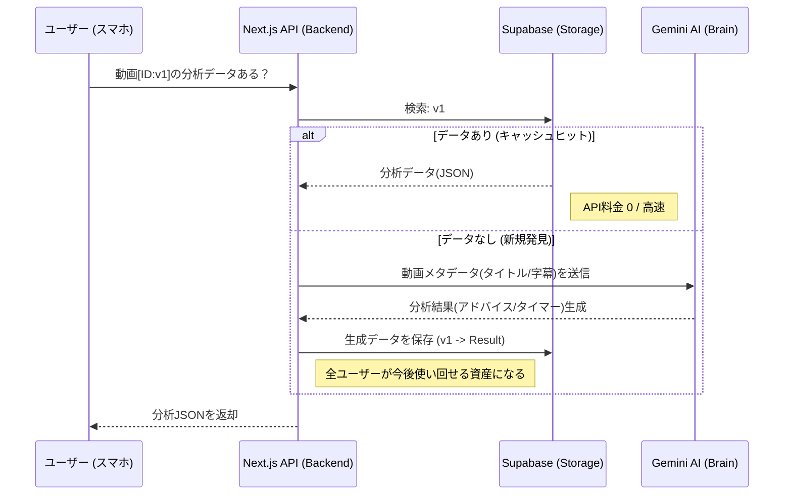

# GFN App: AI分析・データベース連携設計ロードマップ

## 1. コンセプト
「AI (Gemini) が動画を専属トレーナーとして分析し、ユーザー全員でその知恵を共有・蓄積する」資産型フィットネス・プラットフォーム。

## 2. アーキテクチャ図 (Shared AI Analysis)

## 3. マネタイズの動線 (Ad Reward Implementation)
1. **初期状態 (Standard):**
   - ホーム画面には最新5本のみ表示。
   - 個別動画のアドバイス（AI ANALYSIS GUIDE）は**マスク表示（Blur/Lock）**。
2. **開放条件 (Premium Experience):**
   - ユーザーが「🔓 広告を見て全解放」ボタンをタップ。
   - **報酬:** 
     - ホーム画面の全50本×購読者数分のリストが閲覧可能。
     - 個別動画の **AI ANALYSIS GUIDE がクリアに読める** ようになり、タイマー機能も有効化。
3. **ビジネス的メリット:**
   - ユーザーAが広告を見て「新規分析」を発生させ、ユーザーBが広告を見て「蓄積された分析」を利用する。
   - どちらも広告収益が発生するが、ユーザーBのケースでは Gemini API コストが発生しないため、**純粋な利益**が最大化される。

## 4. データベース構成案 (Supabase)
### Table: `exercise_guides`
- `video_id`: (Primary Key) YouTube Video ID
- `title`: 動画タイトル (メタ保存用)
- `form_guide`: Gemini生成のフォーム解説
- `focus_points`: 注目ポイント (string array)
- `difficulty`: 初級/中級/上級
- `estimated_cals`: 推定消費カロリー
- `timer_points`: タイマー発動時間のリスト (JSON)
- `created_at`: 生成日時

## 5. 次回実装ステップの優先順位
1. **Gemini API 連携:** プロンプトエンジニアリング（特定のフォーマットで返してもらう設定）。
2. **UI Update:** 個別動画ページの「分析ガイド」部分に、未課金状態のロック表示（ボカシ加工）を追加。
3. **Supabase 導入:** データの永続化。自分自身のテスト視聴を「資産（DBデータ）」として貯めていく管理者機能の検討。
